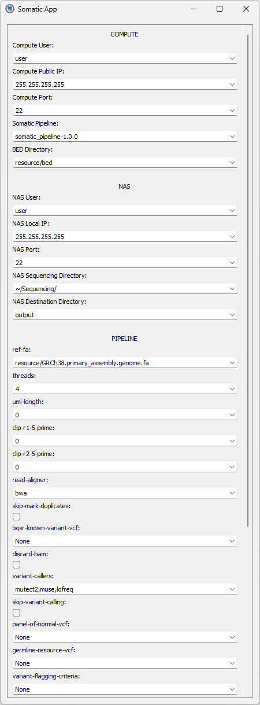

# Somatic App



### Server configuration

Create a `~/SomaticApp` in the user's name directory, which is the root directory of the SomaticApp.
A typical directory structure is shown below:

```
~/SomaticApp/
├── .bash_profile
├── fastq/
├── resource/
└── somatic_pipeline-1.0.0/
```

The `.bash_profile` defines all things needed to be activated to run the `somatic_pipeline-1.0.0`.
An example of the `.bash_profile` is shown below:

```bash
source $HOME/anaconda3/bin/activate somatic
export PATH=$PATH:$HOME/opt/ensembl-vep-release-106
export PATH=$PATH:$HOME/opt/VarDict-1.8.3/bin
```

Other files/directories are described as follows:

- `fastq/`: Directory containing all fastq files
- `resource/`: Directory containing all resource files (such as reference genome or VEP cache)
- `somatic_pipeline-1.0.0/`: The `somatic_pipeline` which can be downloaded from [here](https://github.com/linyc74/somatic_pipeline/releases)
