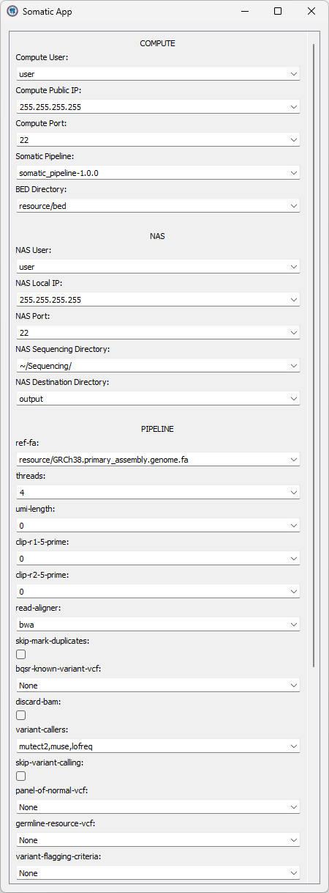

# Somatic App



### Server configuration

Create a `~/SomaticApp` in the user's name directory, which is the root directory of the SomaticApp.
A typical directory structure is shown below:

```
~/SomaticApp/
├── .profile
├── fastq/
├── resource/
└── somatic_pipeline-1.0.0/
```

The `.profile` defines all things needed to be activated to run the `somatic_pipeline-1.0.0`.
An example of the `.profile` is shown below:

```bash
source $HOME/anaconda3/bin/activate pcgr
export PATH=$PATH:$HOME/opt
export PATH=$PATH:$HOME/opt/TrimGalore-0.6.10
export PATH=$PATH:$HOME/opt/VarDict-1.8.3/bin
export PATH=$PATH:$HOME/opt/bcftools-1.23
export PATH=$PATH:$HOME/opt/MANTIS
```

Other files/directories are described as follows:

- `fastq/`: Directory containing all fastq files
- `resource/`: Directory containing all resource files (such as reference genome or VEP cache)
- `somatic_pipeline-1.0.0/`: The `somatic_pipeline` which can be downloaded from [here](https://github.com/linyc74/somatic_pipeline/releases)
